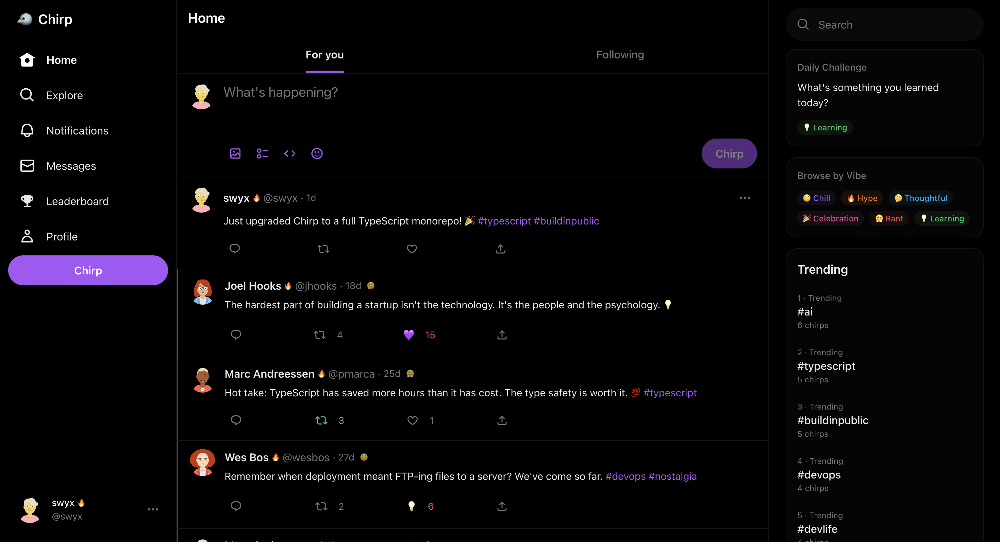
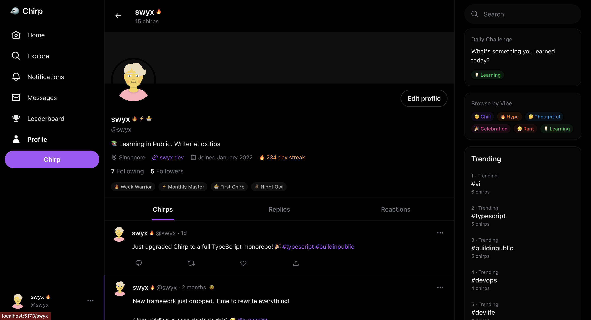
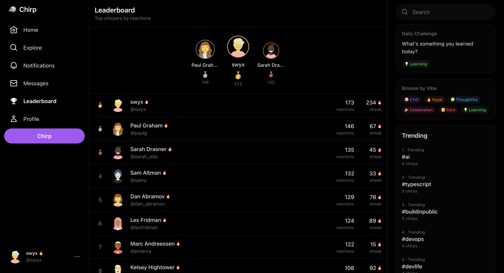
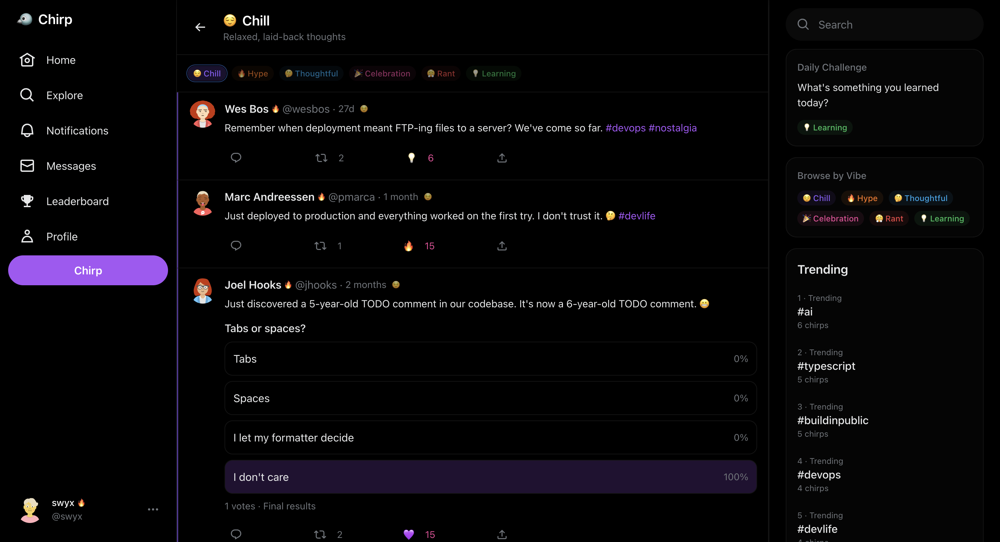

# Chirp

> **Portfolio Project** — A full-stack application demonstrating modern web development practices including TypeScript, React, Node.js, PostgreSQL, Docker, CI/CD, and real-time features.

**[Live Demo](https://genuine-encouragement-production.up.railway.app)** · **[GitHub](https://github.com/SeanBNU/chirp)**

[](https://github.com/SeanBNU/chirp/actions/workflows/ci.yml)
[](https://opensource.org/licenses/MIT)
[](https://railway.app/template/chirp)

A modern, full-stack social media platform for developers. Think Twitter, but built for the dev community with unique features like code snippets, vibes, achievements, and streaks.


## Screenshots

<!-- Add your screenshots here -->
<p align="center">
  
</p>

<details>
<summary>View more screenshots</summary>

| Feature | Screenshot |
|---------|------------|
| Profile Page |  |
| Leaderboard |  |
| Vibes Filter |  |

</details>

## Skills Demonstrated

This project showcases proficiency in:

| Category | Technologies & Concepts |
|----------|------------------------|
| **Frontend** | React 18, TypeScript, Vite, TanStack Query, Zustand, Tailwind CSS, Responsive Design |
| **Backend** | Node.js, Express, TypeScript, REST API Design, JWT Authentication, WebSockets |
| **Database** | PostgreSQL, Prisma ORM, Database Schema Design, Migrations, Seeding |
| **DevOps** | Docker, Docker Compose, GitHub Actions CI/CD, Environment Configuration |
| **Testing** | Vitest, React Testing Library, Unit & Integration Tests |
| **Architecture** | Monorepo Structure, Clean Architecture, Separation of Concerns, Type Safety |
| **Best Practices** | ESLint, Input Validation (Zod), Error Handling, Security Headers (Helmet), Logging |

## Features

### Core Features
- **Authentication** - JWT-based auth with secure password hashing
- **Tweets (Chirps)** - Create, read, delete with media support
- **Reactions** - Multiple reaction types (fire, rocket, insightful, love, funny, mindblown)
- **Retweets** - Share posts with your followers
- **Replies** - Threaded conversations
- **Follow System** - Follow/unfollow users
- **Direct Messages** - Real-time private messaging
- **Notifications** - Live notifications via WebSocket
- **Search** - Search users, tweets, and hashtags
- **Trending** - See what's trending

### Unique Features
- **Vibes** - Tag posts with moods (Chill, Hype, Thoughtful, Celebration, Rant, Learning)
- **Achievements** - Unlock badges for milestones
- **Streaks** - Track consecutive posting days
- **Polls** - Create interactive polls
- **Code Snippets** - Share syntax-highlighted code
- **Leaderboard** - See top users by engagement

## Tech Stack

### Frontend
- **React 18** with TypeScript
- **Vite** for blazing fast builds
- **TanStack Query** for server state management
- **Zustand** for client state
- **Tailwind CSS** for styling
- **Socket.io Client** for real-time updates

### Backend
- **Node.js** with Express
- **TypeScript** throughout
- **Prisma ORM** with PostgreSQL
- **Socket.io** for WebSockets
- **Zod** for validation
- **JWT** for authentication
- **Helmet** for security
- **Pino** for logging

### Infrastructure
- **Docker** & Docker Compose
- **PostgreSQL** database
- **Redis** for caching (optional)
- **GitHub Actions** for CI/CD

## Architecture

```
chirp/
├── apps/
│   ├── api/                 # Express backend
│   │   ├── src/
│   │   │   ├── controllers/ # HTTP request handlers
│   │   │   ├── services/    # Business logic
│   │   │   ├── middleware/  # Express middleware
│   │   │   ├── routes/      # API routes
│   │   │   ├── validators/  # Zod schemas
│   │   │   └── utils/       # Helpers
│   │   └── prisma/          # Database schema
│   └── web/                 # React frontend
│       └── src/
│           ├── components/  # UI components
│           ├── pages/       # Route pages
│           ├── hooks/       # Custom hooks
│           ├── services/    # API client
│           └── stores/      # Zustand stores
├── packages/
│   └── shared/              # Shared types
├── docker-compose.yml
└── .github/workflows/       # CI/CD
```

## Getting Started

### Prerequisites

- Node.js 18+
- Docker and Docker Compose
- npm or yarn

### Installation

1. **Clone the repository**
   ```bash
   git clone https://github.com/SeanBNU/chirp.git
   cd chirp
   ```

2. **Start the database**
   ```bash
   docker compose up -d postgres
   ```

3. **Install dependencies**
   ```bash
   npm install
   ```

4. **Set up environment variables**
   ```bash
   cp apps/api/.env.example apps/api/.env
   ```

5. **Generate Prisma client and run migrations**
   ```bash
   npm run db:generate
   npm run db:push
   ```

6. **Seed the database**
   ```bash
   npm run db:seed
   ```

7. **Start the development servers**
   ```bash
   npm run dev
   ```

8. **Open the app**
   
   Navigate to [http://localhost:5173](http://localhost:5173)

### Demo Accounts

After seeding, you can log in with these accounts (password: `password123`):

| Username | Name | Streak |
|----------|------|--------|
| swyx | swyx | 234 days |
| dan_abramov | Dan Abramov | 156 days |
| sarah_edo | Sarah Drasner | 89 days |
| kentcdodds | Kent C. Dodds | 312 days |
| cassidoo | Cassidy Williams | 145 days |

## Development

### Available Scripts

```bash
# Start all services in development
npm run dev

# Start only the API
npm run dev:api

# Start only the web app
npm run dev:web

# Run tests
npm test

# Lint code
npm run lint

# Build for production
npm run build

# Database commands
npm run db:generate  # Generate Prisma client
npm run db:migrate   # Run migrations
npm run db:push      # Push schema changes
npm run db:seed      # Seed database
npm run db:studio    # Open Prisma Studio
```

### Docker Commands

```bash
# Start all services
docker compose up -d

# Stop all services
docker compose down

# View logs
docker compose logs -f

# Rebuild after changes
docker compose build
```

## API Endpoints

### Authentication
- `POST /api/auth/register` - Register new user
- `POST /api/auth/login` - Login
- `GET /api/auth/me` - Get current user

### Users
- `GET /api/users/:username` - Get user profile
- `PUT /api/users/profile` - Update profile
- `POST /api/users/:username/follow` - Follow user
- `DELETE /api/users/:username/follow` - Unfollow user
- `GET /api/users/:username/followers` - Get followers
- `GET /api/users/:username/following` - Get following

### Tweets
- `GET /api/tweets/feed` - Get feed
- `POST /api/tweets` - Create tweet
- `GET /api/tweets/:id` - Get tweet
- `DELETE /api/tweets/:id` - Delete tweet
- `GET /api/tweets/:id/replies` - Get replies
- `POST /api/tweets/:id/react` - Add reaction
- `POST /api/tweets/:id/retweet` - Retweet
- `POST /api/tweets/:id/vote` - Vote on poll
- `GET /api/tweets/vibe/:vibe` - Get tweets by vibe
- `GET /api/tweets/user/:username` - Get user's tweets

### Notifications
- `GET /api/notifications` - Get notifications
- `GET /api/notifications/unread` - Get unread count
- `PUT /api/notifications/read` - Mark all as read

### Messages
- `GET /api/messages` - Get conversations
- `GET /api/messages/:username` - Get conversation
- `POST /api/messages` - Send message

### Search
- `GET /api/search?q=query` - Search
- `GET /api/search/trending` - Get trending hashtags
- `GET /api/search/leaderboard` - Get leaderboard
- `GET /api/search/challenge` - Get daily challenge

## Testing

```bash
# Run all tests
npm test

# Run API tests
npm run test --workspace=@chirp/api

# Run web tests
npm run test --workspace=@chirp/web

# Run with coverage
npm run test -- --coverage
```

## Deployment

The app is designed to run locally with Docker. For production deployment, you would:

1. Set up a PostgreSQL database (e.g., Neon, Supabase, Railway)
2. Deploy the API to a Node.js host (e.g., Railway, Render, Fly.io)
3. Deploy the frontend to a static host (e.g., Vercel, Netlify)
4. Configure environment variables for production

## Contributing

1. Fork the repository
2. Create a feature branch (`git checkout -b feature/amazing-feature`)
3. Commit your changes (`git commit -m 'Add amazing feature'`)
4. Push to the branch (`git push origin feature/amazing-feature`)
5. Open a Pull Request

## License

MIT License - see [LICENSE](LICENSE) for details.

---

Built with care by a passionate full-stack developer.
